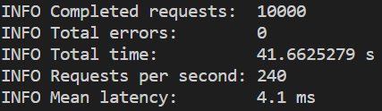
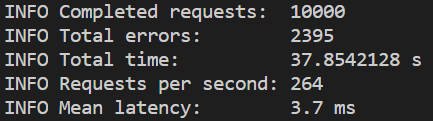

# SSAFY_Daliy_Project

## 200311|Day05| 성능 향상을 위한 캐시 적용

### 가상 메모리

#### 개념

- 프로세스 전체가 메모리 내에 올라오지 않더라도 실행이 가능하도록 하는 기법
- 프로그램이 물리 메모리보다 커도 된다는 장점

#### 특징

- 실제의 물리 메모리 개념과 사용자의 논리 메모리 개념을 분리한 것
- 작은 메모리를 가지고도 얼마든지 큰 가상 주소 공간을 프로그래머에게 제공 가능

#### 가상 주소 공간

- 한 프로세스가 메모리에 저장되는 논리적인 모습을 가상메모리에 구현한 공간
- 직접적으로 필요치 않은 메모리 공간은 실제 물리 메모리에 올리지 않는 것으로 물리 메모리를 절약 가능

#### 캐시 메모리

- 속도가 빠른 장치와 느린 장치간의 속도차에 따른 병목 현상을 줄이기 위한 범용 메모리
- CPU가 어떤 데이터를 원할 것인가를 어느 정도 예측 가능해야함

#### 캐시의 지역성

- 예측한 데이터의 적중율을 극대화 시키기 위해 데이터 지역성의 원리 사용
- 지역성의 전제조건으로 프로그램은 모든 코드나 데이터를 균등학 접근하지 않는다는 특성을 기본으로 함
  - 시간 지역성 : 최근에 참조된 주소의 내용은 곧 다음에 다시 참조되는 특성
  - 공간 지역성 : 대부분의 실제 프로그램이 참조된 주소와 인접한 주소의 내용이 다시 참조되는 특성

###  Redis

#### 개념

- 고성능 key-value 저장소
- List, Hash, set 등 여러 형식의 자료구조를 지원하는 NoSQL
- 메모리에 상주하면서 RDBMS의 캐시 솔루션으로서 주로 사용


### 산출물

Python Django로 과제를 진행하였습니다.

##### 진행과정

- 현재 Redis는 공식적으로 **Windows** 버전을 제공하지 않음. 하지만 MS Open Tech에 의해 비공식적으로 제공되는 **Windows 64-bit** 바이너리 파일을 다운 가능

- 설치 후 redis server.exe 실행

- 프로젝트 Python Django sever 실행

  - ```bash
    python manage.py runserver
    ```

- settings.py에 CACHES 추가

  - ```python
    # settings.py
    CACHES = {
        'default': {
            'BACKEND': 'django_redis.cache.RedisCache',
            'LOCATION': 'redis://127.0.0.1:6379/1',
            "OPTIONS": {
                "CLIENT_CLASS": "django_redis.client.DefaultClient",
            }
        },
    }
    ```

- 많은 양의 영화 목록 Data로 인해 병목현상이 발생하므로 views.py 에 movie_list부분을 캐시로 바꿔줌

  - ```python
    # 캐시 설정 전
    def movie_list(request):
        movies = Movie.objects.all()
        genres = Genre.objects.all()
    	movies = serializers.serialize('json', movies, fields=('title', 'poster_url', 'release_date','genre', ))
        genres = serializers.serialize('json', genres, fields=('name', ))
        return render(request, 'movies/movie_list.html', {
            'movies': movies,
            'genres': genres,
        })
    ```

  - ```python
    # 캐시 설정 후
    def movie_list(request):
        movies = Movie.objects.all()
        genres = Genre.objects.all()
        movies = cache.get_or_set('movies', serializers.serialize('json', movies, fields=('title', 'poster_url', 'release_date','genre', )))
    
        genres = serializers.serialize('json', genres, fields=('name', ))
        return render(request, 'movies/movie_list.html', {
            'movies': movies,
            'genres': genres,
        })
    ```

- 많은 양의 http요청을 보내기 위해 loadtest 모듈을 설치

  - ```bash
    npm install -g loadtest
    ```

- 요청 보내기

  - ```bash
    loadtest -n 10000 http://127.0.0.1:8000/movies
    ```

    - 변경 전
    - 
    - 변경 후
    - 

  - 약 4초 정도의 차이가 나는 것을 볼 수 있음


### 느낀점

프로젝트 때 Front-end쪽을 많이 공부하다 보니 Back에 대해서는 잘 알 수 있는 기회가 많이 없었는데 이번 과제를 통해 캐시 메모리에 대해 조금 이해할 수 있었습니다.