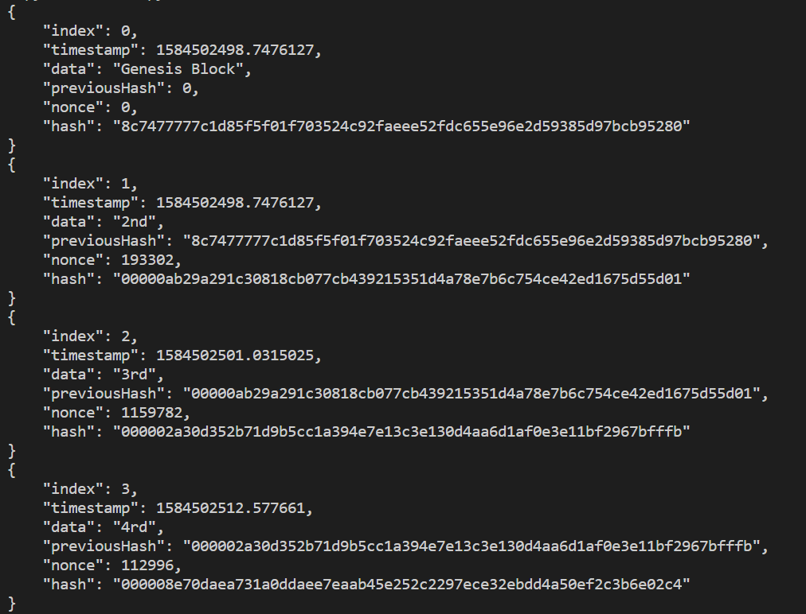

# SSAFY_Daliy_Project

## 200318|Day08| 블록체인 간단 구현

### 블록체인

#### 개념

- 소규모 데이터들을 P2P(Peer to Peer) 방식을 기반으로 생성된 분산 데이터 저장하는 환경
- 분산 컴퓨팅 기술 기반의 원장 관리 기술
  - 분산컴퓨팅 : 인터넷에 연결된 여러 컴퓨터들의 처리 능력을 이용하여 거대한 계산 문제를 해결하려는 분산처리 모델
- 비트코인을 비롯한 대부분의 암호화폐 거래에 사용
- 탈 중앙화 : 중앙에 존재하는 은행 없이 개인 간의 자유로운 거래가 가능

#### 블록 해시

- 해시함수 : 임의의 길이의 데이터를 고정된 길이의 데이터로 매핑하는 함수
  - 뭘 넣든 비슷한 길이의 알 수 없는 난수가 결과로 출력
  - 글자가 한글자만 바뀌어도 완전히 다른 결과가 출력
  - 출력값으로 입력값을 예측 불가능
  - 같은 내용을 입력값으로 주면 결과값은 항상 같음
- 블럭을 처음 만들 때는 이전의 블록이 없기 때문에 해시값도 존재하지 않음 따라서 empty 값 또는 random 값을 넣어줌 (Genesis 블록)

### 산출물

- Console 실행 환경 구현

  - VS Code에서 Python으로 실행

- 블록에 대한 구조체(객체) 구현

  - ```python
    class Block():
        def __init__(self, index, timestamp, data):
            self.index = index
            self.timestamp = timestamp
            self.data = data
            self.previousHash = 0
            self.nonce = 0
            self.hash = self.calHash()
    ```

- 해시함수는 sha256 사용. sha256 사용

  - ```python
    def calHash(self):
            return hashlib.sha256(str(self.index).encode() + str(self.data).encode() + 
    str(self.nonce).encode() + 
    str(self.timestamp).encode() + str(self.previousHash).encode()).hexdigest()
    ```

- Genesis 블록 생성 

  - ```python
    class BlockChain:
        def __init__(self, ):
            self.chain = []
            self.difficulty = 5
            self.createGenesis()
    
        def createGenesis(self):
            self.chain.append(Block(0, time.time(), 'Genesis Block'))
    ```

- Genesis 블록 해시값을 다음 블록에서 기억

  - ```python
    def mine(self, difficulty):
            ans = ["0"]*difficulty
            answer = "".join(ans)
            while(str(self.hash)[:difficulty] != answer):
                self.nonce += 1
                self.hash = self.calHash()
    
            return self.hash
    ```

- 이후 해시값은 앞에 "0"이 5 개인 경우만 통과

  - ```python
    def __init__(self, ):
            self.chain = []
            self.difficulty = 5
            self.createGenesis()
    def isValid(self):
            i = 1
            while(i<len(self.chain)):
                if(self.chain[i].hash != self.chain[i].calHash()):
    
                    return False
                if(self.chain[i].previousHash != self.chain[i-1].hash):
    
                    return False
                i += 1
            return True
    ```

- 블록이 생성될 때마다 블록 내용 console 출력

  - ```python
    for block in onion.chain:
        print(json.dumps(vars(block), indent=4))
    ```

- 블록 3개 이상 생성

  - ```python
    onion = BlockChain()
    onion.addBlock(Block(len(onion.chain),time.time(), "2nd"))
    onion.addBlock(Block(len(onion.chain),time.time(), "3rd"))
    onion.addBlock(Block(len(onion.chain),time.time(), "4rd"))
    onion.addBlock(Block(len(onion.chain),time.time(), "5rd"))
    ```

- 결과
  - 