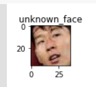

# SSAFY_Daliy_Project

## 200319|Day09|Google Colab기반 얼굴인식

### Google Colab

- 설치가 필요없고, 코드를 작성하고, 돌려보고, 공유할 수 있는 클라우드 기반의 무료 주피터(Jupyter) 노트 환경입니다.


### 산출물

- Hello World 출력

  - ```python
    print('Hello World')
    ```

- 일주일은 몇 초 인지 표시하는 코드

  - ```python
    one_second = 1
    one_minute = one_second*60
    one_hour = one_minute*60
    one_day = one_hour*24
    one_week = one_day*7
    print(one_week)
    ```

- 사진 켭쳐

  - Visualization: Linked Brushing in Altair 코드 스니펫 사용

  - ```python
    # Visualization: Linked Brushing in Altair
    # load an example dataset
    from vega_datasets import data
    cars = data.cars()
    
    import altair as alt
    
    interval = alt.selection_interval()
    
    base = alt.Chart(cars).mark_point().encode(
      y='Miles_per_Gallon',
      color=alt.condition(interval, 'Origin', alt.value('lightgray'))
    ).properties(
      selection=interval
    )
    
    base.encode(x='Acceleration') | base.encode(x='Horsepower')
    ```

  - 

  - 사진 캡쳐

  - ```python
    from IPython.display import display, Javascript
    from google.colab.output import eval_js
    from base64 import b64decode
    
    def take_photo(filename='photo.jpg', quality=0.8):
      js = Javascript('''
        async function takePhoto(quality) {
          const div = document.createElement('div');
          const capture = document.createElement('button');
          capture.textContent = 'Capture';
          div.appendChild(capture);
    
          const video = document.createElement('video');
          video.style.display = 'block';
          const stream = await navigator.mediaDevices.getUserMedia({video: true});
    
          document.body.appendChild(div);
          div.appendChild(video);
          video.srcObject = stream;
          await video.play();
    
          // Resize the output to fit the video element.
          google.colab.output.setIframeHeight(document.documentElement.scrollHeight, true);
    
          // Wait for Capture to be clicked.
          await new Promise((resolve) => capture.onclick = resolve);
    
          const canvas = document.createElement('canvas');
          canvas.width = video.videoWidth;
          canvas.height = video.videoHeight;
          canvas.getContext('2d').drawImage(video, 0, 0);
          stream.getVideoTracks()[0].stop();
          div.remove();
          return canvas.toDataURL('image/jpeg', quality);
        }
        ''')
      display(js)
      data = eval_js('takePhoto({})'.format(quality))
      binary = b64decode(data.split(',')[1])
      with open(filename, 'wb') as f:
        f.write(binary)
      return filename
    ```

  - ```python
    from IPython.display import Image
    try:
      filename = take_photo()
      print('Saved to {}'.format(filename))
      
      # Show the image which was just taken.
      display(Image(filename))
    except Exception as err:
      # Errors will be thrown if the user does not have a webcam or if they do not
      # grant the page permission to access it.
      print(str(err))
    ```

- 구글 드라이브 연동

  - ```python
    from google.colab import drive
    drive.mount('/gdrive')
    ```

- 여러가지 도형 그리기

  - ```bash
    !pip install -q matplotlib-venn
    ```

  - ```bash
    !apt-get -qq install -y libfluidsynth1
    ```

  - ```python
    import numpy as np
    import cv2
    from google.colab.patches import cv2_imshow
    
    # Create a black image
    img = np.zeros((512,512,3), np.uint8)
    
    img = cv2.line(img,(0,0),(511,511),(255,0,0),5)
    img = cv2.rectangle(img,(384,0),(510,128),(0,255,0),3)
    img = cv2.circle(img,(447,63), 63, (0,0,255), -1)
    img = cv2.ellipse(img,(256,256),(100,50),0,0,180,(255,0,0),-1)
    
    # img = cv2.imread('logo.png', cv2.IMREAD_UNCHANGED)
    cv2_imshow(img)
    ```

  - 

- 얼굴 인석

  - ```bash
    !pip install face_recognition
    ```

  - ```python
    import cv2, os
    import face_recognition as fr
    from IPython.display import display
    from matplotlib import pyplot as plt
    
    image_path = "/gdrive/My Drive/colab/image.jpg"
    
    image = fr.load_image_file(image_path)
    face_locations = fr.face_locations(image)
    
    for (top, right, bottom, left) in face_locations:
      cv2.rectangle(image, (left, top), (right, bottom), (0, 255, 0), 3)
    
    plt.rcParams["figure.figsize"] = (16, 16)
    plt.imshow(image)
    plt.show()
    ```

  - 

- 같은 인물 찾기

  - ```python
    plt.rcParams["figure.figsize"] = (1, 1)
    
    known_person_list = []
    known_person_list.append(fr.load_image_file("/gdrive/My Drive/colab/son_1.jpg"))
    known_person_list.append(fr.load_image_file("/gdrive/My Drive/colab/Alie.jpg"))
    known_person_list.append(fr.load_image_file("/gdrive/My Drive/colab/Kane.jpg"))
    known_person_list.append(fr.load_image_file("/gdrive/My Drive/colab/be.jpg"))
    
    known_face_list = []
    for person in known_person_list:
      top, right, bottom, left = fr.face_locations(person)[0]
      face_image = person[top:bottom, left:right]
    
      known_face_list.append(face_image)
    
    for face in known_face_list:
      plt.imshow(face)
      plt.show()
    ```

  - 

  - unknown_face

  - ```python
    unknown_person = fr.load_image_file("/gdrive/My Drive/colab/son_2.jpg")
    
    top, right, bottom, left = fr.face_locations(unknown_person)[0]
    unknown_face = unknown_person[top:bottom, left:right]
    
    plt.title('unknown_face')
    plt.imshow(unknown_face)
    plt.show()
    ```

  - 

  - 비교 결과

  - ```python
    enc_unknown_face = fr.face_encodings(unknown_face)
    for face in known_face_list:
      enc_known_face = fr.face_encodings(face)
    
      distance = fr.face_distance(enc_known_face, enc_unknown_face[0])
    
      plt.title("distance" + str(distance))
      plt.imshow(face)
      plt.show()
    ```

  - 